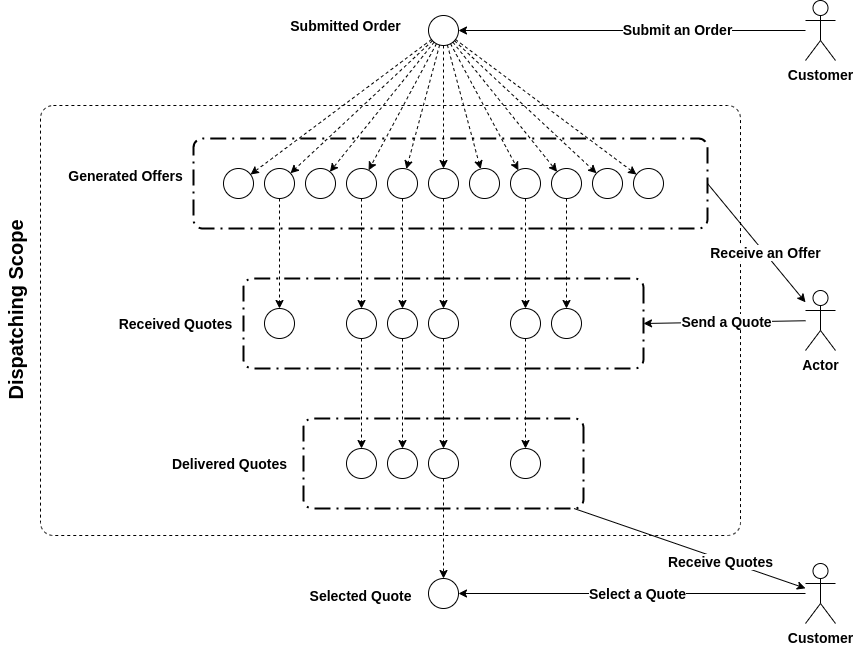
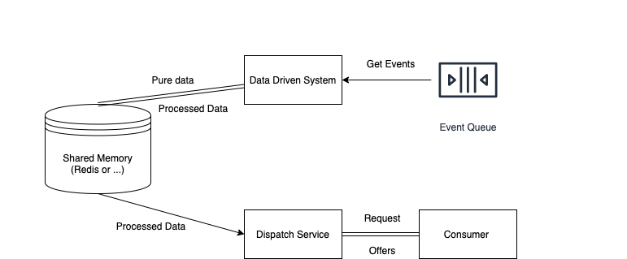
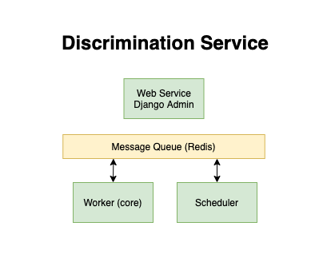
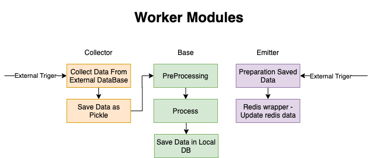

# A Balance Regulator for Supply-Deman Marketplace Business

* This balancer is a value proposition of the company and we just put the abstract of the system.

## What is a home service marketplace

The home service marketplace is a type of business that connects the demand (customers' order) to the supply (providers). The customer submits an order, the platform sends the offers to the providers, providers send quotes, and the customer receives the quotes and accepts one of the quotes. This journey progresses in the home service platform

## What is dispatching

Dispatching is a set of processes in which a job offer and price are received from providers for a specific order.

For a submitted order, based on the required service and the profile of related specialists and their status, a list of specialists is selected and a job offer (Offer) is sent to them.
Receives quotes received by providers for the desired order.
From the list of provider quotes, selects a list of offers to display to the customer and show it to the customer.

## Data-Driven Dispatching

### Microservice Architecture

The main architecture of the system is microservice-based architecture. So, we need to implement an external microservice for calculating and processing the service-city providers. We have had some concentration:

1. Flexibility on-demand changing the algorithms
2. 99.99 Uptime of the system
3. Least sensitivities to the error on the data-driven side

As a result, we put a shared memory (currently Redis) to put the calculated data and have a common data structure on both sides. 

### Data-Driven System Architecture

The data-driven system writes in the Django framework with the Celery task manager. But Django just is a framework to handle the database schemas and migrations. We use some high-level libraries such as scikit-learn and TensorFlow. We have a lot of offline tasks handled by Celery and Celery-Beat.

The workflow of the data-driven system:

This system used in the first home-service marketplace in Iran. 

Author: Seyed Mohammad Hosseini
Contact: mohammad.hoseyny@gmail.com
